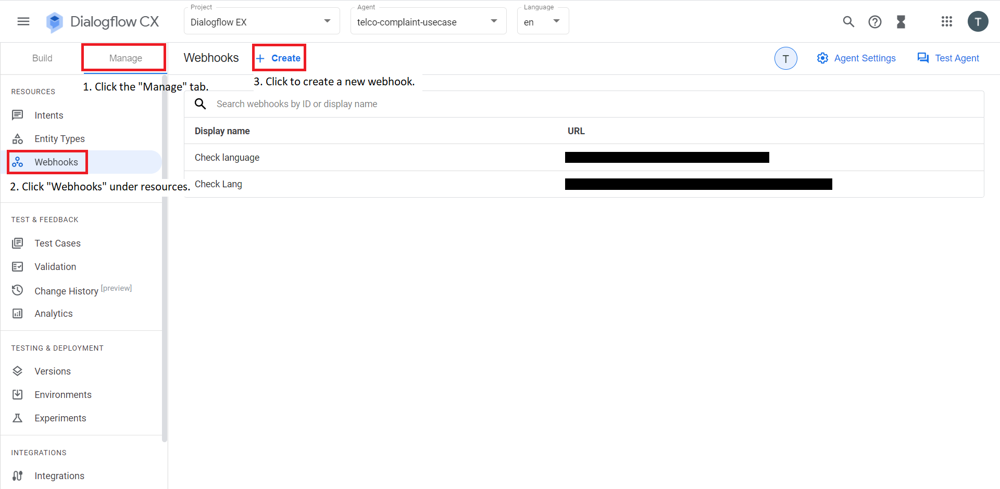
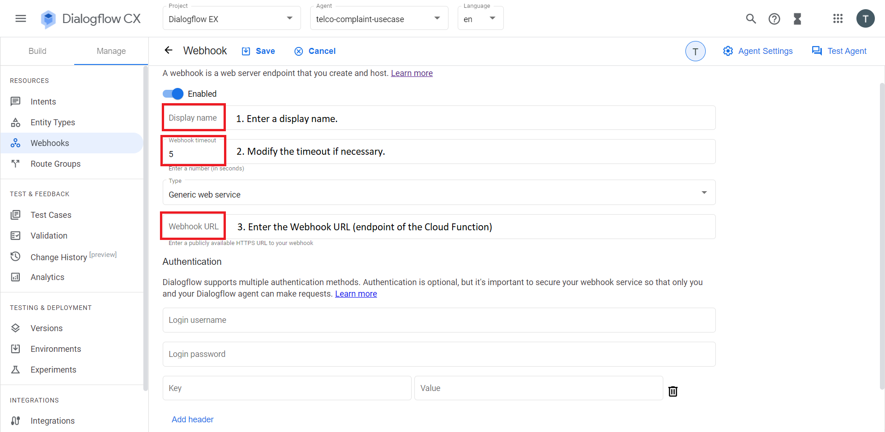
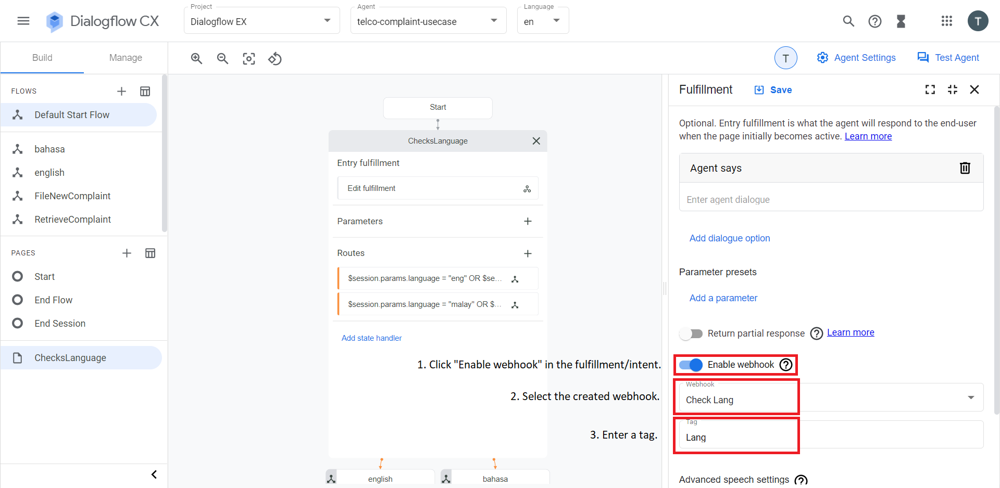

# Integrate your Custom Webhook into Dialogflow
1. Create a webhook in Dialogflow under Manage > Webhooks.
    - Configure the display name, webhook timeout and webhook URL.
    - Enter the trigger URL of the cloud function as the webhook URL.
    []()
2. Enable the webhook option where desired and choose the webhook from the dropdown menu.
    - Enter a required tag.
    []()
3. The parameters returned in the response of the webhook can now be used in conditions. For example, in this case where the webhook returns the detected language, this could be referenced by:
    ```
    $session.params.language
    ```
    []()
